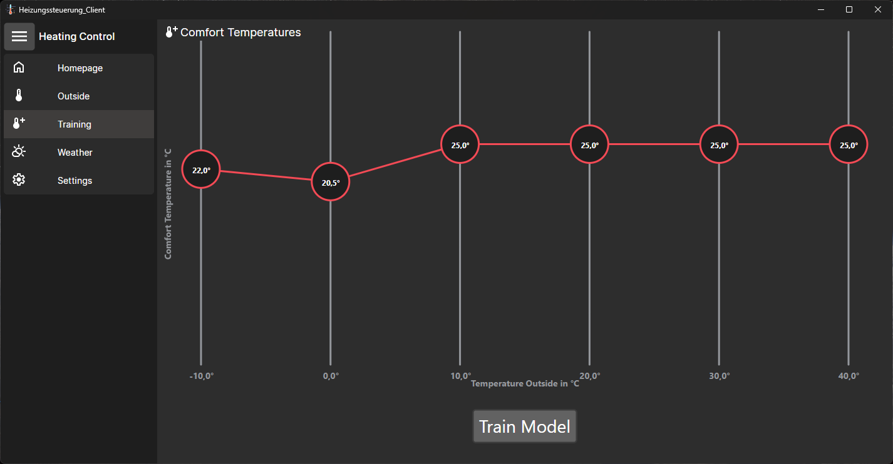
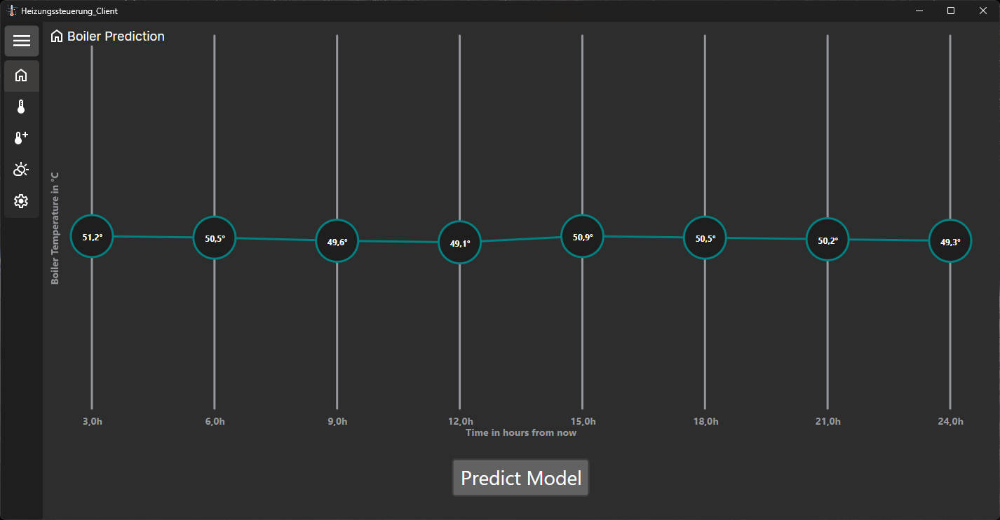
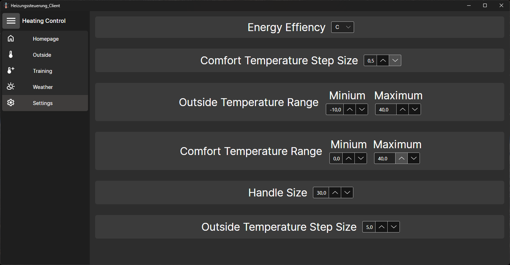

# Heizungssteuerung

**Projektbeteiligte**
- Florian Noever
- Christopher Guschky
- Ramon Pütz
  

**Allgemeine Informationen**

Das Projekt "Heizungssteuerung" beinhaltet eine KI-gestützte Steuerung für ein Heizungssystem, wobei mithilfe einer Wetter-API die optimale Kesseltemperatur ermittelt werden kann. 
Wir haben die Möglichkeit geschaffen, dabei die Energieeffizienzklasse des jeweiligen Gebäudes, in welchem sich die Heizung befindet zu berücksichtigen. Die Kesseltemperatur ändert sich entsprechend, je nach Energieeffizienzklasse.
  

**Vorgehensweise im Client**

Oben links kann man das Menü öffnen, mit welchem man zwischen den einzelnen User Controls wechseln kann. Im ersten Schritt muss die KI trainiert werden, dazu wechselt man auf den Reiter "Training".
  

Im ersten Schritt muss die KI trainiert werden. 
Es kann zusätzlich die Isolationsklasse des Gebäudes ausgewählt werden. Die KI berücksichtigt diesen Wert im Training um die optimale Kesseltemperatur zu berechnen. 
Im Reiter "Training" öffnet sich das user Control "Comfort Temperatures". Am unteren Bildschirmrand hat der User nun die Mögichkeit, die KI mit dem Button "Train Model" zu trainieren. 
Nachdem der Ladebildschirm durchgelaufen ist, ist die KI trainiert.
  

Dies ist daran zu erkennen, dass sich der Text innerhalb des Buttons geändert hat. 
Der **Accuracy-Wert** gibt Information darüber wie die durschnittliche Abweichung der KI zum Soll-Wert ist. Dieser Wert kann sich um einen gewissen Maße nach jedem Trainingslauf verändern.  
Außerdem hat der User hier noch die Möglichkeit, die **Wohlfühltemperatur** mit den Schiebreglern einzustellen. Jeder Regler steht für eine bestimmte Außentemperatur. Der User kann nun einstellen, auf wie viel Grad das Gebäude bei den jeweiligen Außentemperaturen geheizt werden soll.  
Der Default-Wert ist bei allen Außentemperaturen 20°C.
  

Wenn der User auf den Reiter "Homepage" klickt, öffnet sich das User Control "Boiler Temperature". 
In diesem User Control muss der User, nachdem die KI trainiert wurde, auf den Button "Predict Model" klicken.  
Daraufhin wird die optimale Kesseltemperatur für die nächsten 24 Stunden angezeigt. 
Je nachdem, was der User für die Energieeffizienzklasse eingetragen hat, erhöhen oder verringern sich die Werte in diesem User Control.
  

Wenn der User über den Reiter "Weather" das entsprechende User Control öffnet, hat er hier die Möglichkeit die Außentemperaturen für den Standort "Krefeld" einzusehen. 
Die Daten werden für die nächsten 24 Stunden im 3-Stunden-Takt angezeigt. 
Der User kann diese Übersicht über den Button "Update Weather" aktualisieren. 
Die Wetterdaten werden über eine API zur Verfügung gestellt.
  

Durch den Reiter "Settings" kann der User das entsprechende User Control für die Einstellungen der Heizungssteuerung öffnen. 
Was die einzelnen Einstellungen bewirken, wird per Tooltips an den jeweiligen Stellen im Detail erklärt.
  
